# Apps_Dev_101
Creating Apps
### This is the extension for app Ideas
<ul>
 <li> The first step is to Learn java </li>
 <li> This is the first from the series of App devs </li>
 <li> The Library is of JavaFx which is good for java UI </li>
</ul>
<h3>Features of the developed</h3>
<ol>
 <li> This GUI converts the Binary Number to Decimal</li>
 <li> This app also has a feature for Entering 8 bits</li>
 <li> Error handling has been properly done </li>
</ol>
<a href="https://github.com/florinpop17/app-ideas/blob/master/Projects/1-Beginner/Bin2Dec-App.md"> Bin2Dec</a>
<ul>
 <li>Demo 001 Shows how the Design Looks </li> 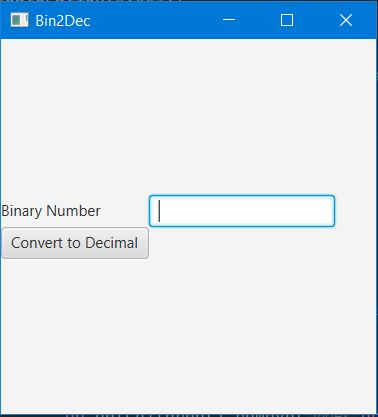
 <li>Demo 010 is for the type of Invalid Input</li> 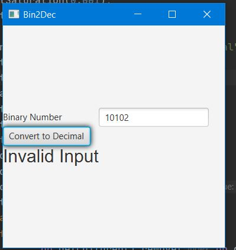
 <li>Demo 011 Shows Valid Input</li> 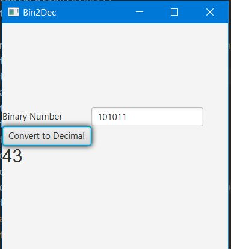
 <li>Demo 100 Shows another Invalid Input</li> 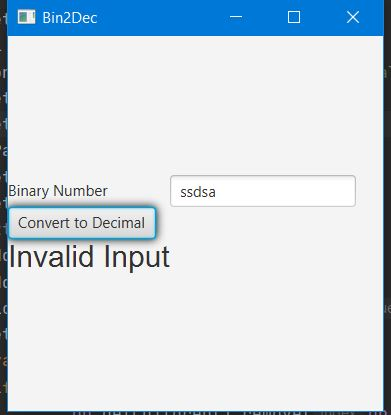
</ul>
<h3>Features of the developed</h3>
<ol>
 <li> This GUI helps to visualize the concept of Border box in CSS</li>
 <li> This app has feature of multiple editing</li>
 <li> When you are done copy the css in the middle and paste to get the same shape</li>
 <li> Any errorneous character is parsed to 0 </li>
</ol>
<a href="https://github.com/florinpop17/app-ideas/blob/master/Projects/1-Beginner/Border-Radius-Previewer.md"> CSS_Border Box</a>
<ul>
 <li>Demo 001 Shows how the Design Looks </li> 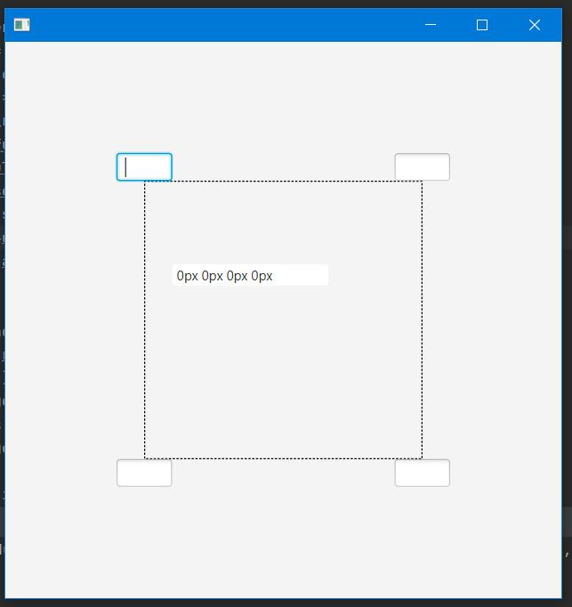
 <li>Demo 010 is for the left top corner change</li> 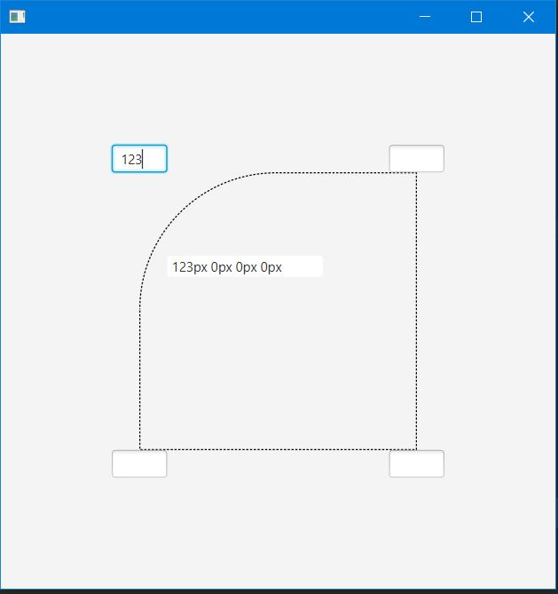
 <li>Demo 011 Shows the right top corner</li> 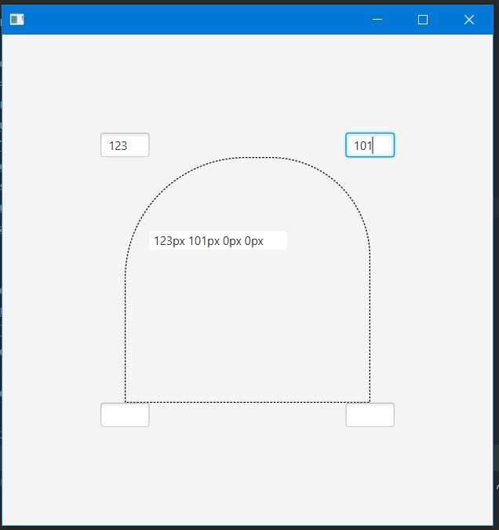
 <li>Demo 100 Shows the left bottom corner</li> 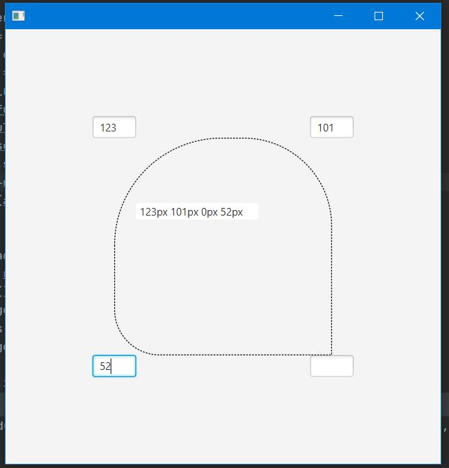
 <li>Demo 101 Shows the right bottom corner</li> 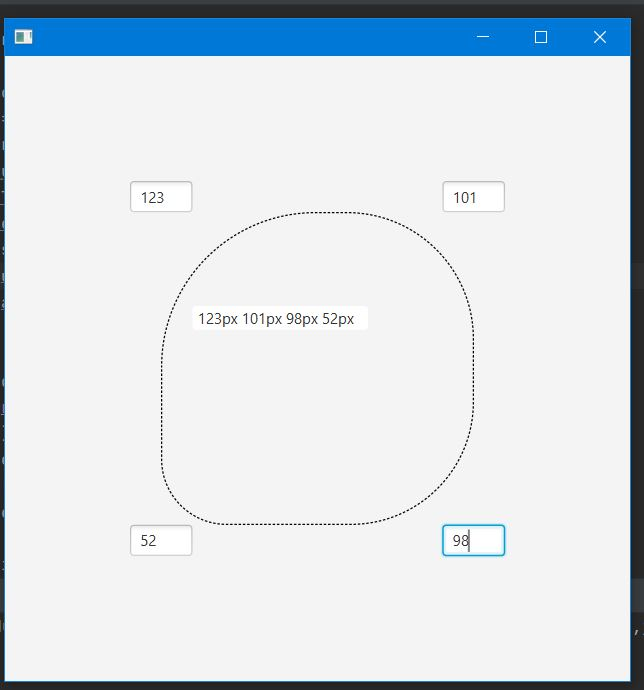
 <li>Demo 110 Shows the Invalid Input</li> 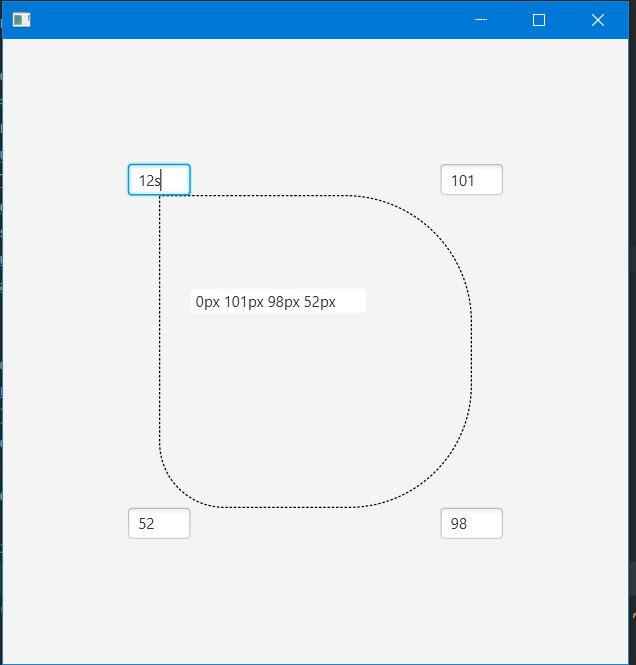
</ul>
<ul>
 <li>Demo 001 Shows how the Design Looks </li> 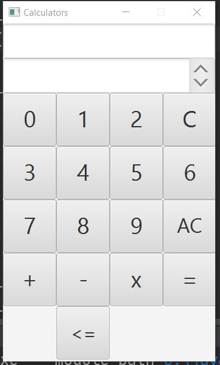
 <li>Demo 010 is for the left top corner change</li> 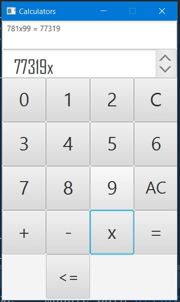
 <li>Demo 011 Shows the right top corner</li> 
 <li>Demo 100 Shows the left bottom corner</li> 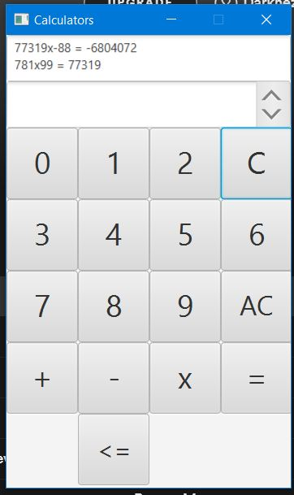
 <li>Demo 101 Shows the right bottom corner</li> 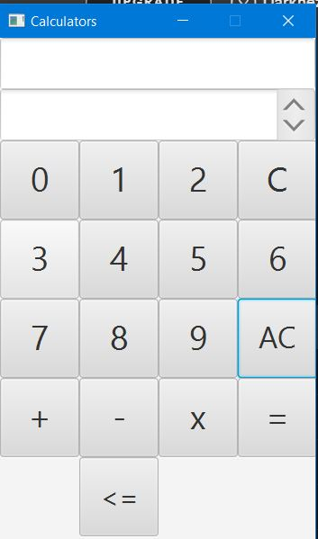
 <li>Demo 110 Shows the Invalid Input</li> 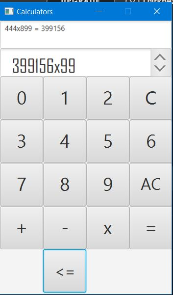
</ul>
<h2>//TODO: Add screenshots of calculator app</h2>

   
  

